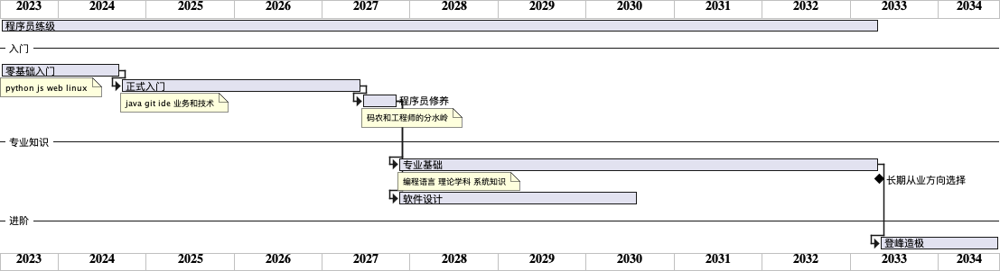

陈皓老师的开篇词，总结起来就

一张图，三个问题，两篇文章，五点建议。

## 一张路线图

## 三个关键问题

### 理论和现实的差距

是还没有找到相关的场景，来感受到那些学院派知识的强大威力。如果感觉理论知识无用，就说明在从事的是工人的工作，而不是工程师的工作。

### 技术能力的瓶颈

就是懒，学习了解的太少

### 技术太多学不过来

同上。总之就是要坚持学习。

## 两篇文章

[Teach Yourself Programming in Ten Years](https://zhuanlan.zhihu.com/p/362436854)

程序员的荒谬之言还是至理名言

## 五点建议

1. 坚持学习，甚至是终身学习
2. 要动手，不管多简单的东西，不能眼高手低
3. 学会思考，举一反三
4. 独立思考，不乱买书，不乱追新技术新名词
5. 以史为鉴，判断未来发展方向