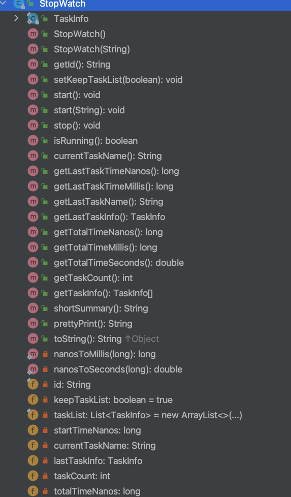
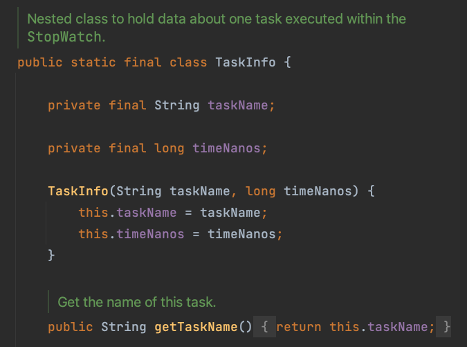
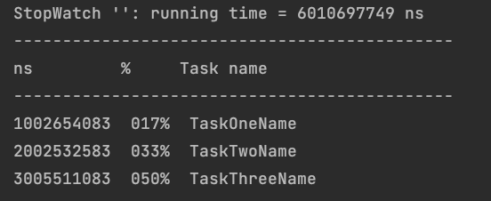
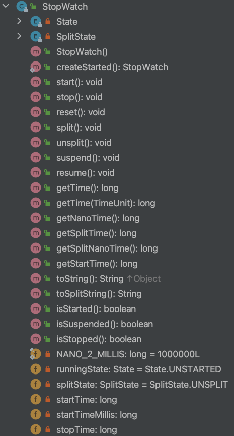
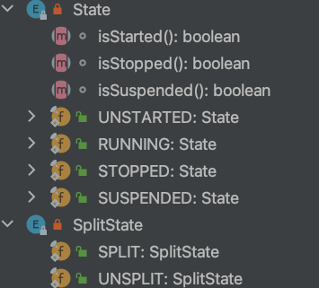
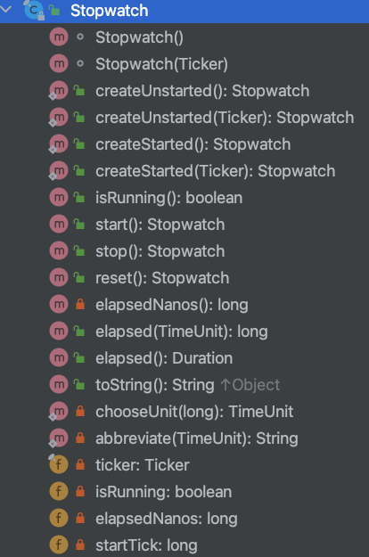

## 一般情况

惯常都是通过System.currentTimeMillis()，然后打印时间段得到的对吧

```java
        /**
         * 传统计时方式
         */
        Long startTime = System.currentTimeMillis();
        // 你的业务代码
        Long endTime = System.currentTimeMillis();
        Long elapsedTime = (endTime - startTime) / 1000;
        System.out.println("[传统计时]该段总共耗时：" + elapsedTime + "s");
```

从公众号文章了解到StopWatch之后，简单了解了下，要用起来，优雅起来~

## Spring的StopWatch类

类的基本信息：

- 包：org.springframework.util

- 状态、方法和内部类：

  

从StopWatch的类的定义，以及作者的注释，能轻易读出以下内容：

- StopWatch的定义是

    > Simple stop watch, allowing for timing of a number of tasks, exposing total running time and running time for each named task.
    > Conceals use of System.nanoTime(), improving the readability of application code and reducing the likelihood of calculation errors.
    > Note that this object is not designed to be thread-safe and does not use synchronization.
    > This class is normally used to verify performance during proof-of-concept work and in development, rather than as part of production applications.

    - 简单的秒表实现
    - 线程不安全
    - 可以记录一系列task的耗时情况
    - 使用的是System.nanoTime()方法，对外隐藏，以增强可读性和减少计算错误

  - id属性来标识StopWatch

  - keepTaskList，这个比较特殊，默认为true，具体后面再说；

  - taskList，任务列表；每次有新的start的任务，会默认加入到这个list中去

  - startTimeNanos：当前任务的起始时间，纳秒

  - lastTaskInfo，最后一个task的信息

  - 类的行为基本模拟了现实生活中的秒表实物

    - 开始->计时->暂停->下一个任务->最终记录->清零
    - start()->stop()->start()->stop...->shortSummary()/prettyPrint()

  - 任务是定义的内部类TaskInfo，记录了每个task的任务名称和耗时

有了上面的信息之后，基本上掌握了使用代码的撰写：

  ```java
          /**
           * Spring的StopWatch
           */
          StopWatch stopWatch = new StopWatch();
  
          // 任务一模拟休眠1秒钟
          stopWatch.start("TaskOneName");
          Thread.sleep(1000 * 1);
          System.out.println("当前任务名称：" + stopWatch.currentTaskName());
          stopWatch.stop();
  
          // 任务二模拟休眠2秒钟
          stopWatch.start("TaskTwoName");
          Thread.sleep(1000 * 2);
          System.out.println("当前任务名称：" + stopWatch.currentTaskName());
          stopWatch.stop();
  
          // 任务三模拟休眠3秒钟
          stopWatch.start("TaskThreeName");
          Thread.sleep(1000 * 3);
          System.out.println("当前任务名称：" + stopWatch.currentTaskName());
          stopWatch.stop();
  
          // 打印出耗时
          System.out.println(stopWatch.prettyPrint());
          System.out.println(stopWatch.shortSummary());
          // stop后它的值为null
          System.out.println(stopWatch.currentTaskName());
  
          // 最后一个任务的相关信息
          System.out.println(stopWatch.getLastTaskName());
          System.out.println(stopWatch.getLastTaskInfo());
  
          // 任务总的耗时 如果你想获取到每个任务详情（包括它的任务名、耗时等等）可使用
          System.out.println("所有任务总耗时：" + stopWatch.getTotalTimeMillis());
          System.out.println("任务总数：" + stopWatch.getTaskCount());
          System.out.println("所有任务详情：" + stopWatch.getTaskInfo());
  ```

接下来，从这个简单的类我们再仔细看下，稍微给力一点。

### 核心逻辑

可以简单认为都在stop里面了

  ```java
  	public void stop() throws IllegalStateException {
  		if (this.currentTaskName == null) {
  			throw new IllegalStateException("Can't stop StopWatch: it's not running");
  		}
  		long lastTime = System.nanoTime() - this.startTimeNanos;
  		this.totalTimeNanos += lastTime;
  		this.lastTaskInfo = new TaskInfo(this.currentTaskName, lastTime);
  		if (this.keepTaskList) {
  			this.taskList.add(this.lastTaskInfo);
  		}
  		++this.taskCount;
  		this.currentTaskName = null;
  	}
  ```

  1. System.nanoTime() 
  
     native方法，Returns the current value of the running Java Virtual Machine's high-resolution time source, in nanoseconds.
  
  2. 还是传统的相减来做计时的
  
  3. taskName必须不为null，否则无法stop秒表

  4. 一个StopWatch实例一次只能开启一个task，不能同时start多个task

  5. 在该task还没stop之前不能start一个新的task，必须在该task stop之后才能开启新的task

ps.素养的体现：工具类内不兜底处理异常，抛出有含义的异常类型和信息出去。

  ### 神奇的taskName

  1. 标识问题

  直观的以为taskName来标识每一个task的，然后就以为不能有两个start()的操作，但实验发现不是。

  仔细看了下TaskInfo类型，没有标识这一说法，其实就是taskName和timeNanos两个状态确认的而已。

  

  2. taskName为null的问题

     代码标识这个taskName是可以为空的，Nullable，但是上面的stop()逻辑明确表示不允许为null，不知道为啥要这样设计；

### keepTaskList的作用

```java
//Configure whether the StopWatch.TaskInfo array is built over time.
//Set this to false when using a StopWatch for millions of intervals; otherwise, the TaskInfo structure will consume excessive memory.
//Default is true.
	public void setKeepTaskList(boolean keepTaskList) {
		this.keepTaskList = keepTaskList;
	}
```

这个参数决定了当前StopWatch实例是否保存任务信息，还是说记录时间之后就抛弃掉；

之所以这样设计作者也说明了，就是追求简单的秒表实现，不搞复杂了；

默认是要记录的，但当记录大量任务的时候，为了避免这种“支线任务”占用太多宝贵的内存空间，建议手动设置为false；

影响的地方是stop的时候的list入列，两种日志打印的输出，获取任务信息的情况。

### 学习信息输出

提供了summary和prettyPrint两种输出



这种做法以及pretty关于数字的展示的做法，都值得学习的

```java
			NumberFormat nf = NumberFormat.getNumberInstance();
			nf.setMinimumIntegerDigits(9);
			nf.setGroupingUsed(false);
			NumberFormat pf = NumberFormat.getPercentInstance();
			pf.setMinimumIntegerDigits(3);
			pf.setGroupingUsed(false);
			for (TaskInfo task : getTaskInfo()) {
				sb.append(nf.format(task.getTimeNanos())).append("  ");
				sb.append(pf.format((double) task.getTimeNanos() / getTotalTimeNanos())).append("  ");
				sb.append(task.getTaskName()).append('\n');
			}
```

另外，有趣的地方还有一个，是获取毫秒和秒的细节：

```java
	private static long nanosToMillis(long duration) {
		return TimeUnit.NANOSECONDS.toMillis(duration);
	}

	private static double nanosToSeconds(long duration) {
		return duration / 1_000_000_000.0;
	}
```

- 用了不同的实现
- double的写法

## Apache的StopWatch类



包路径：org.apache.commons.lang3.time

Apache这个StopWatch具有更多行为能力，可以split、unsplit，可以suspend、再resume，可以reset；

实现复杂能力的核心是加入了两个枚举：State和SplitState



所有的行为，基本都根据这两个状态来的；每种状态又对应不同的标识行为。

关于这个类的其他说明，参考注释即可：

> StopWatch provides a convenient API for timings.
> To start the watch, call start() or createStarted(). At this point you can:
>
> - split() the watch to get the time whilst the watch continues in the background. unsplit() will remove the effect of the split. At this point, these three options are available again.
>
> - suspend() the watch to pause it. resume() allows the watch to continue. Any time between the suspend and resume will not be counted in the total. At this point, these three options are available again.
>
> - stop() the watch to complete the timing session.
>
> It is intended that the output methods toString() and getTime() should only be called after stop, split or suspend, however a suitable result will be returned at other points.
> NOTE: As from v2.1, the methods protect against inappropriate calls. Thus you cannot now call stop before start, resume before suspend or unsplit before split.
>
> 1. split(), suspend(), or stop() cannot be invoked twice 
>
> 2. unsplit() may only be called if the watch has been split() 
>
> 3. resume() may only be called if the watch has been suspend() 
>
> 4. start() cannot be called twice without calling reset()
>
> This class is not thread-safe
> Since:
> 2.0

关键点：

- 线程不安全
- 方法之间有耦合关系

根据上面的用法说明，随便写个示例：

```java
    private static void apacheStopWatchTest() throws InterruptedException {
        /**
         * Apache
         */
        //创建后立即start，常用
        org.apache.commons.lang3.time.StopWatch watch = org.apache.commons.lang3.time.StopWatch.createStarted();

        // StopWatch watch = new StopWatch();
        // watch.start();

        Thread.sleep(1000);
        System.out.println(watch.getTime());
        System.out.println("统计从开始到现在运行时间：" + watch.getTime() + "ms");

        Thread.sleep(1000);
        watch.split();
        System.out.println("从start到此刻为止的时间：" + watch.getTime());
        System.out.println("从开始到第一个切入点运行时间：" + watch.getSplitTime());


        Thread.sleep(1000);
        watch.split();
        System.out.println("从开始到第二个切入点运行时间：" + watch.getSplitTime());

        // 复位后, 重新计时
        watch.reset();
        watch.start();
        Thread.sleep(1000);
        System.out.println("重新开始后到当前运行时间是：" + watch.getTime());

        // 暂停 与 恢复
        watch.suspend();
        System.out.println("暂停2秒钟");
        Thread.sleep(2000);

        // 上面suspend，这里要想重新统计，需要恢复一下
        watch.resume();
        System.out.println("恢复后执行的时间是：" + watch.getTime());

        Thread.sleep(1000);
        watch.stop();

        System.out.println("花费的时间》》" + watch.getTime() + "ms");
        // 直接转成s
        System.out.println("花费的时间》》" + watch.getTime(TimeUnit.SECONDS) + "s");
    }
```

### 关于split()

啥是split呢？看了半天没懂，还是得看代码。

其实从代码来看，split()和suspend()基本是一样的

```java
    public void split() {
        if (this.runningState != State.RUNNING) {
            throw new IllegalStateException("Stopwatch is not running. ");
        }
        this.stopTime = System.nanoTime();
        this.splitState = SplitState.SPLIT;
    }

    public void suspend() {
        if (this.runningState != State.RUNNING) {
            throw new IllegalStateException("Stopwatch must be running to suspend. ");
        }
        this.stopTime = System.nanoTime();
        this.runningState = State.SUSPENDED;
    }
```

都记录了stopTime等于当前时间，但是状态改变不同；

更重要的是对应的后续操作也是不同的：split()对应的是getSplitTime()方法，suspend()对应的是resume()；

```java
    public long getSplitNanoTime() {
        if (this.splitState != SplitState.SPLIT) {
            throw new IllegalStateException("Stopwatch must be split to get the split time. ");
        }
        return this.stopTime - this.startTime;
    }

    public void resume() {
        if (this.runningState != State.SUSPENDED) {
            throw new IllegalStateException("Stopwatch must be suspended to resume. ");
        }
        this.startTime += System.nanoTime() - this.stopTime;
        this.runningState = State.RUNNING;
    }
```

所以通过split()可以明显看出状态的使用：

- 运行状态完全由State来判断
- split状态完全由SplitState来判断
- 两者几乎可以认为是完全独立的

而split()的作用可以通过代码理解，即在秒表始终在运行的状态下，拿到时间点记录情况。就好比长跑比赛计时的时候，一方面要记录每个运动员时间，一方面表要一直跑着这样子。这时候重新看split()的解释就比较清晰了。

> split() the watch to get the time whilst the watch continues in the background. unsplit() will remove the effect of the split. At this point, these three options are available again.

### 缺憾

关于数据的输出，确实不如Spring的丰富，只有toString()。等于说完全交给调用方来实现自己的了。

```java
    /**
    * Gets a summary of the time that the stopwatch recorded as a string.
		* The format used is ISO 8601-like, hours:minutes:seconds.milliseconds.
		* Returns:
		* the time as a String
    **/
		@Override
    public String toString() {
        return DurationFormatUtils.formatDurationHMS(getTime());
    }
// 00:00:04.015
```

## Guava的StopWatch类



包路径：com.google.common.base

基本能力就是开始，停止，重置，耗时情况这些，比较简单。比较特殊的是使用了Ticker类进行的计时。追一下源码还是System.nanoTime()。当然了，使用了Ticker抽象类的话，实际上是可以自己进行时间源替换的，自定义啥的。

核心逻辑是stop()

```java
  public Stopwatch stop() {
    long tick = ticker.read();
    checkState(isRunning, "This stopwatch is already stopped.");
    isRunning = false;
    elapsedNanos += tick - startTick;
    return this;
  }
```

没什么可说的。

另外，不得不说的是Google的代码注释写的更好些，轻松的根据注释写示例代码

```java
    private static void guavaStopWatchTest() throws InterruptedException {
        Stopwatch gsw = Stopwatch.createStarted();
        Thread.sleep(1000);
        gsw.stop();
        System.out.println("gsw 记录时间："+gsw.elapsed());
    }
```

## 小结

建议多用StopWatch类记录程序耗时，正如最后的Guava注释说的那样：

> As documented by nanoTime, the value returned has no absolute meaning, and can only be interpreted as relative to another timestamp returned by nanoTime at a different time. Stopwatch is a more effective abstraction because it exposes only these relative values, not the absolute ones.

秒表是相比于时间戳更抽象的含义，使用秒表更合适表达耗时这个含义。

关于不同的StopWatch的选择，做个表格吧，对比下几个方面

| 比较方面   | Spring                                | Apache                          | Guava        |
| ---------- | ------------------------------------- | ------------------------------- | ------------ |
| 基本功能   | 简单的start，stop；附加记录多任务能力 | 完全模拟功能秒表，具备split能力 | 耗时         |
| 线程安全   | 不安全                                | 不安全                          | 不安全       |
| 时间源替换 | 不可以                                | 不可以                          | 可以         |
| 结果描述   | 有summary和pretty两种文字描述         | toSting                         | 只有耗时时间 |

## 参考资料

- [别再用currentTimeMillis统计耗时了，太 Low，试试StopWatch吧！](https://mp.weixin.qq.com/s/qI9IwSijXewlh8OHOTcstg)