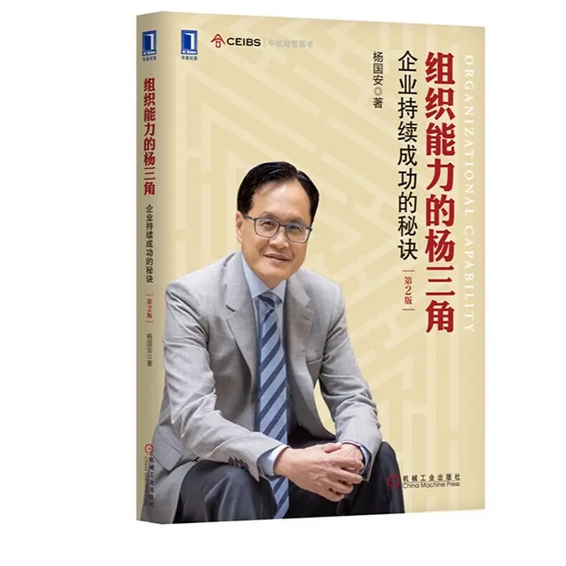
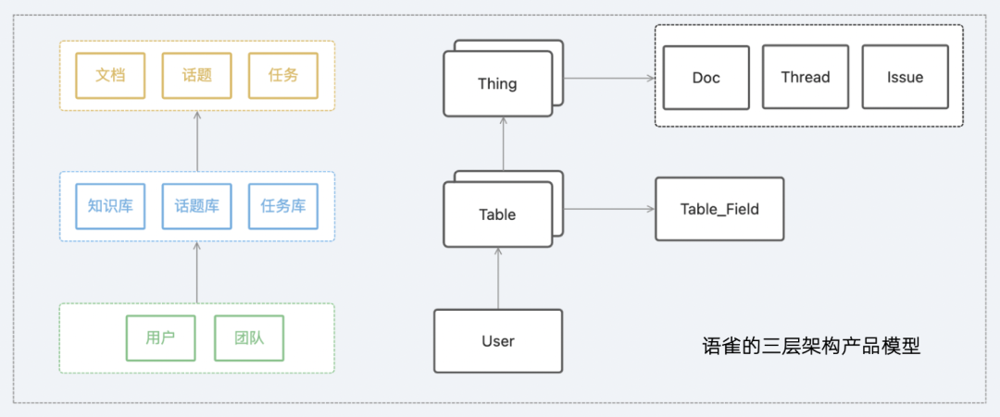
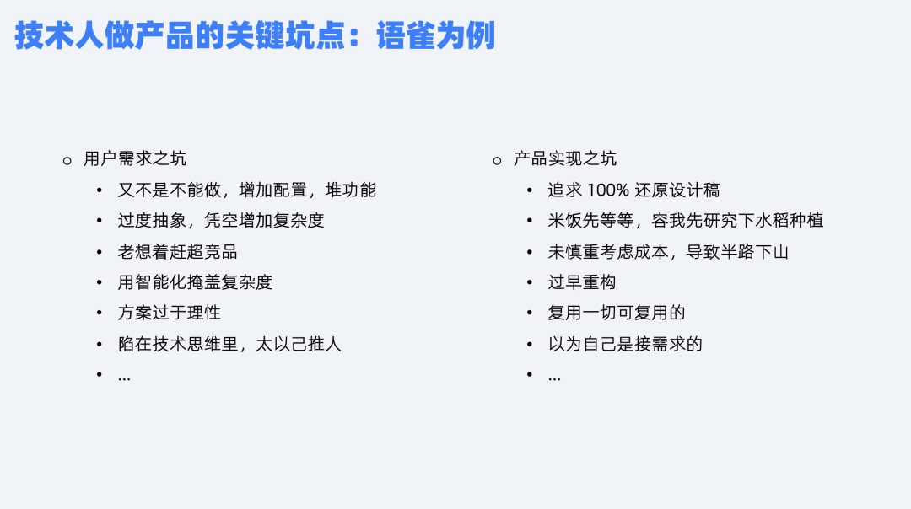
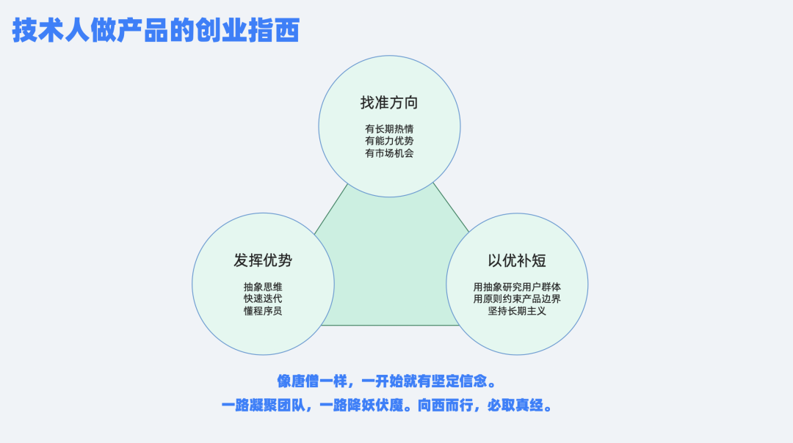

技术人除了做技术还能做什么？我想很多人都想过这个话题。

其中的一个答案是「做产品」，因为，每个技术人心目中都会有一个产品梦。今天想跟大家聊一下这个话题：技术人如何做产品，谈谈我在做产品的过程中的一些感受。

先做一个简单自我介绍，我叫玉伯，08 年加入阿里，写代码写了十几年，一直在前端、小程序和客户端领域，希望能够推动整个终端技术往前发展。这十几年里，也一直带领团队通过开源做了很多技术产品，包括 Ant Design、AntV 等。但今天想聊的不是这些，而是「语雀」。

本次分享的内容分成四部分，谈谈我们如何选择产品方向，可能遇到哪些问题，以及技术人的核心优势。

## 技术人如何选择创业方向

这里用的词是「创业」，在我看来，在大公司内部做产品，和创业很像。特别是在如今的大环境下，在公司内部创业，可能是一个无论对个人还是对公司都更好的方向。

在创业过程中，很多技术人遇到的第一个命题，就是如何选择产品方向。

杰出的华人管理大师杨国安教授，在很早前提出一个组织能力的杨三角理论，对这个问题做了非常有意思的回答。

书里谈到三个关键点。第一个关键点是团队组织**愿不愿意**去做这件事，这是选择产品方向的原点。比如说我们要去做一个工具、做一个类库，或者是创业去做一个产品，团队创始人以及核心同学的意愿是至关重要的。

第二个关键点，是团队核心成员**有没有能力**去做，实际上会不会？这是杨三角的第二点。

第三个关键点，在公司或整个市场环境里，在天时地利上，环境**容不容许**我们去做这件事？

杨三角谈的是组织能力建设，但对于技术人选择产品方向来说，也是很核心的三个思考维度。当你这么去想，然后会发现，很多公司的技术产品，或者说轮子，为什么在内部创业做不出来，是因为遇上了三个陷阱：

**第一个陷阱，是团队有意愿，但是市场或者公司环境不容许**。可以举我们本身的例子，我们是一个前端团队，在早期的时候曾想做一个数据流量产品，但实际上公司里已经有数据平台团队，最终我们没做下去。原因是，前端团队去做数据产品，在短期可能在体验等方面有优势，但长期从团队定位上来，是重复造自己并无优势的轮子，是不被容许的。

**第二个陷阱，是以为会，其实不会**。做技术的同学往往会比较自信，以为自己懂某一块技术，只要把技术做深，就可以有市场。但是实际具体去做就会发现，在技术产品化的过程中，对产品的理解，对需求的判断，对市场的把握，在很多层面上都是缺失的。所以真正来看的话，其实我们在这件事情上是能力不足的。这里面的要点，是能够吸引到互补性人才，补全团队的短板。

**第三个陷阱，是短期有激情，长期无热情**。很多时候我们做一件事情，刚开始特别有激情，会很冲动，很开心，想挑战世界，挑战自我。但是如果时间拉长，放到一年、两年甚至更长时间的时候，发现可能激情逐步消退，你自己就开始打退堂鼓。一件产品花费五年甚至十年才能成功是很常见的，它需要你长期的热情投入。

我们以语雀为例，来看一下如何将杨三角应用到实际当中。语雀团队最早是 2017 年开始内部孵化，2018 年真正开始做，然后 2019 年开始商业化运作。

以杨三角来判断，首先第一个角度是意愿度。我们在早期还没有语雀的时候，从 2016 年我们就聚集了一批对知识管理、知识协同非常认可的核心成员，并且这一小撮核心成员内心里，对这件事情都很有激情，我们曾经开玩笑说，希望能够做 103 年。这个长期的意愿度，是语雀成败的关键因素之一。

然后是能力度，语雀最开始是诞生于前端和设计团队，是一个融合型团队。这个初始团队的构成，使得我们可以快速做出最小可行产品，同时在用户体验上有原生优势。

最后是容许度，在当时 2017 年左右的时候，整个阿里和蚂蚁内部没有人做这个，看外部市场环境的话，语雀当时也是有机会的。

这个机会不在将文档搬到云端，语雀并不是在做文档，而是选择切入知识库，而当时以知识库为核心的产品并不多。在 2018 到 2019 年的时候，我们以知识库的体验优势，很快在公司内部将 Confluence 和 WIKI 给替换掉了，获得了产品珍贵的早期用户。

而看外面的话，目前整个社会有一种微粒化的趋势。近几年涌现出很多新的知识工作者，比如视频 UP 主，都会选择独立或通过工作室去工作。对于这些个体和小微企业组织，它们也很需要知识管理和知识沉淀，长期来看是需要一个好的工具，而这里就蕴藏着机会。语雀在这一块，相当于从文档的红海跳到知识协同的蓝海。所以从这个方面去看的话，也是语雀非常笃定的原因。

## 技术人做产品的核心优势

一旦我们选择好产品方向，特别是一个愿意长期投入投入的方向。那么接下来的问题是，作为技术人去做产品，究竟有什么样的核心优势，能让我们在竞争中脱颖而出？总结来说，技术人的核心优势可以总结成三点。

**第一个优势是，优秀的技术都会有良好的抽象思维能力**。我们天天在写程序，代码里面有很多先进的技术理念，其实也可以化用到其他领域。比如面向对象，可以用到产品设计里，能够让整个产品模型通过抽象变得简单。

**第二个优势是快速代码验证**。我们经常说，对于产品快速试错能力是很重要的，有时候产品经理有个好点子了，就缺几个程序员把它做出来看到底可不可行。但如果我们本身就是程序员的话，我们可以直接写代码去验证我们的想法。

**最后一个优势，更懂程序员群体**。我们本身是程序员，如果做面向程序员的产品的话，我们更懂程序员这个群体，知道他们的痛点和爽点在哪。

还是以语雀来举例。

语雀的产品模型一开始比较简单，但随着产品发展，功能逐渐增多，对应的产品模型也开始变得复杂。比如在语雀里面，除了文档，还有知识库，知识库还有各种细分类型，比如话题库、画板库等等。然后在这些知识库下面，有文档、表格、画板、任务、话题等不同的文档类型。最开始的时候，我们会针对每一个类型去建模。但这种方式开发起来比较复杂，并且整体研发成本也比较大。

2019 年，我们回头梳理产品，用技术人的思维，把语雀的整体产品模型，定义成比较简单清晰的三层架构。以这种三层架构模型，往前发展会发现，很多事情都变得简单了。

同时，我们总结了适合语雀的产品原则，我们称之为**简单法则：把简单留给用户，但同时也要把简单留给自己**。

在业界可能经常会说，把简单留给用户，但是要把复杂留给自己。但是根据我们自己的实践，当你把复杂留给自己的时候，很多事情很难持续，你的代码最终会变成「祖传代码」，后人不敢轻动。这样的后果就是，当你做着做着，你会发现这个复杂你是控制不住的，最后的话可能还是让用户侧也变得复杂。

所以，当我们看到一个解决方案比较复杂的时候，要反推是不是问题出错了，比如，它不是我们这个产品该做的事情。同样的，我们非常推崇**奥卡姆剃刀法则：如无必要，勿增实体**。

然后，作为程序员，如果你做的产品本身有一批用户是技术人的话，那那就意味着你可以给他们更优秀的体验。

语雀最开始之所以受程序员欢迎，很大一部分原因是我们做了一个 Markdown 编辑器，因为我们本身也在用 Markdown，在研发的过程中解决了很多痛点。

同样的，当我们往前演进，发现很多程序员日常有很多作图的需求，比如画思维导图、架构图、流程图、UML 图等，虽然市面上已经有类似的成熟工具，但在写文档中作图的体验是割裂的。所以语雀推出了画板，日常的这些图都可以通过画板很轻易去实现。这个功能也受到很多程序员同学的好评。

另外，语雀从第一个版本就提供了 Open API。通过 Open API，很多程序员可以去做二次开发，会有一些好玩的，基于语雀去写作的个性化工具。我们还可以通过 webhook，跟钉钉甚至跟飞书去打通，搭建个人的工作流。

这些就是作为技术人做产品的一个核心优势。我们懂程序员，就一定要把这个优势发挥出来。

## 技术人做产品的关键坑点

但是，技术人做产品并不是只有优势，也会有一些技术人特有的坑点，一不小心就可能掉坑里。

我们在做产品的过程中也遇到过很多这样的坑，我们将它总结为两块，一块是**用户需求之坑**，我们在接用户需求，在定义用户需求的时候，可能会经常把问题简单化，这中间会遇到很多坑。另一块是**产品实现之坑**，我们作为技术，通常会很自信去实现一些产品功能，在产品实现过程中也会遇到很多坑。

以语雀团队为例。

### 语雀的用户需求之坑

在用户需求这一块，常常遇到的一个问题是，很多技术同学对自己的技术非常有把握，然后看到用户反馈和建议觉得做起来很简单，可能还没有等产品经理把需求给定义出来，就快速的去往前做。甚至很多时候，可能觉得只要增加一个配置就好，也就是改几行代码的事情。

这样做的结果就是功能堆积。无论在语雀，还是大公司内部很多技术产品，你会发现它的功能界面有做很多功能，同时在很多地方会加很多配置。我觉得这样可能有它必然的一面。但一个 To C 的产品，增加功能一定要非常谨慎。

用户需求坑点这块还有一个，就是很多技术同学容易陷入到技术思维里面，甚至自己都没有意识到。这样做出来的产品，可能符合技术逻辑，但不符合用户习惯。

比如，在语雀创建文档，之前按照语雀的架构是必须要先创建知识库的，如果你不创建知识库，可能你连创建文档的入口都找不到。这个就是站在技术的思维来做用户的功能设计。但是如果按照用户角度去看，其实应该一开始让用户就能新建文档，只是在过程中引导用户去选择知识库。

### 语雀的产品实现之坑

做产品实现也会经常遇到一些坑。比如最典型的，很多刚加入语雀的同学，比较追求百分之百还原设计稿。

可能在很多其他的团队里，产品会觉得百分之百还原设计稿是技术人很好的一个追求。但在语雀我们会非常谨慎这一点。

因为百分之百还原设计稿的前提，是设计稿要做的天衣无缝。但在大部分情况下，设计稿只能说一方面代表新功能，一方面它其实有 demo 的属性。所以技术人一定要分清哪些是产品功能，哪些仅仅是一种演示，不要真的去追求百分之百还原。

产品实现坑点里还有一个段子，就是让技术同学去做饭，他说，等等，让我先研究下水稻种植。这是说技术同学容易陷入到技术原理和细节当中，忽视了研发工期和节奏。

比如在语雀里，有段时间我们在实现多人协作功能。多人协作是一个很有技术难度的点，如果要研究清楚可能要花不少时间，但同时它在业界已经有不少现有方案，我们可以通过开源以及合作等方式可以快速往前走。如果我们真的停下来去研究底层技术的话，可能会让整个功能迭代给停滞住。所以这一块需要非常谨慎。

还有就是，很多技术同学在做产品实现过程中，只是把自己定义成是接需求的，而不去思考需求本身是否合理。任何需求来了，只要定义好了我就去接。但写着写着发现，产品以为的一个简单的需求，其实它的复杂度挺高，做不下去了。

我们发现有很多 case，就是当技术实现难度变大做不下去，往往是需求本身可能是没有考虑好，但如果早期和产品同学一起去分析这个需求的话，是有可能发现并阻止的。

## 技术人做产品的创业指西

最后做一个小结。

当一个技术人，无论是在公司内部做新产品还是出去创业，最重要的有三点。

第一点，要找准方向。你要知道自己的内心究竟长期想做什么，笃定什么，这个长期信念非常关键。然后，当你有了很强的热情，要回头看自己的团队，是否真正有能力做成。如果没有能力优势的话，其实要非常谨慎，因为很容易做着做着就掉到坑里。最后要看市场机会，要看你是否真的有机会去做。

第二点，技术人做产品有非常多的优势，要把自己的抽象思维、体系化思维，把懂程序员的优势充分发挥出来。绝大多数产品做不到尽善尽美，之所以赢得竞争，核心是初创团队的优势是不是能够融入产品。如果在产品中能够把你的一些想法，一些优势充分的发挥出来的话，那整个产品的感觉是非常不一样的。

第三点，技术人并不是万能的，要对自己有清醒的认知，在组建团队时，在很多层面上，比如产品、运营，去找到一些跟自己能力互补的人才。让自己的优势能够转换成整个团队的一些优势，同时把一些短板给补齐。这一块也是非常关键的，要学会以优补短。

之前听某个聊创业播客，里面有一种观点说，创业要有一种「跳悬崖」的勇气。这个比喻是说，想法每个人都有，但从想法到产品有很长的路要走，甚至产品做出来能不能成功也并不确定，所以创业需要极端的，甚至是断掉自己后路的勇气。

可能你在跳悬崖之前只是一个想法，但没有动力去做，但跳下去后在下降过程中，因为你已经跳下去了，所以你会非常急迫的去找方向，去找团队，去找钱，让自己在跌落地面之前起飞。这是很多创业者的一种心态。

这里我想说的是，除了跳悬崖的创业之外，还有一种创业的心态是像唐僧一样，是一种「西天取经」的心态。

所谓唐僧一样的创业，是你一开始在创业之前，内心就已经有了坚定的信念。你想去求真经，你的内心已经非常笃定，哪怕是你一个人也会去开启这段旅程。然后当你开启这段旅程之后，在这过程中去找到同路人，把合适的人凝聚起来形成团队。

当然，在取经路上一定会遭遇很多的困难和艰险，你要一路降妖伏魔。但如果你内心里一开始就有笃定的信念，各种艰难险阻只是时间问题，最终你会取得真经。

## 参考资料

- [玉伯的产品思考：技术人如何做产品](https://mp.weixin.qq.com/s/d0N1BFtVn0uWVqj-lf0FOA)