# 1、画图

## draw.io

draw.io是全能型画图工具，忘了ppt、visio之类的软件吧。它比ProcessOn更好的一点是注重隐私性，可以支持本地编辑文件，而不必同步云端。 可以画几种实用的图：

- 架构图
- 流程图
- 数据库E-R图
- UI原型图

本地编辑，从github下载drawio-desktop桌面软件：https://github.com/jgraph/drawio-desktop/releases 在线编辑地址：https://app.diagrams.net

创建图类型选择：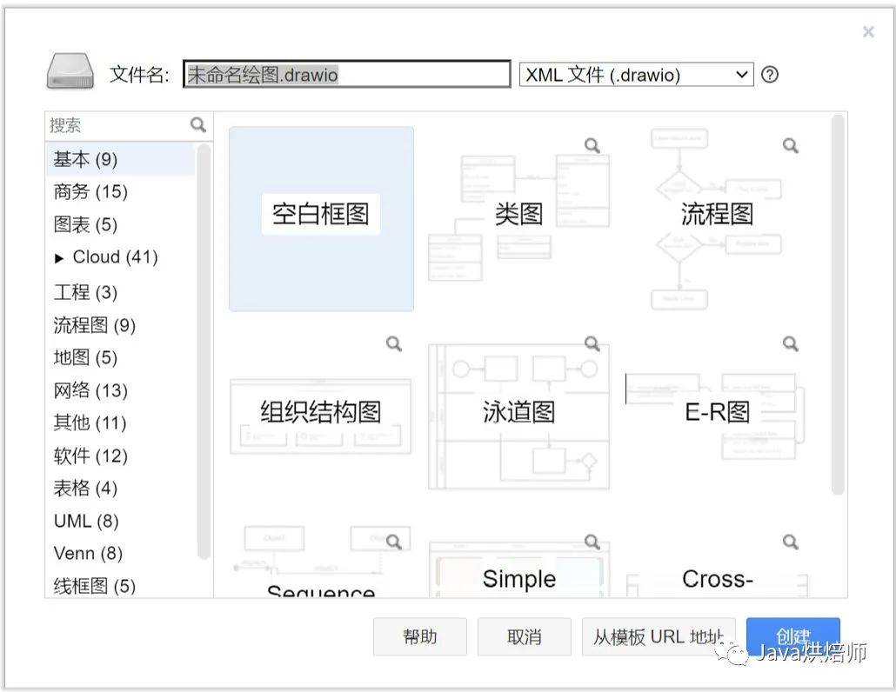

架构图示例：架构图可参考楼主之前写的文章《应用开发中的存储架构进化史——从起步到起飞》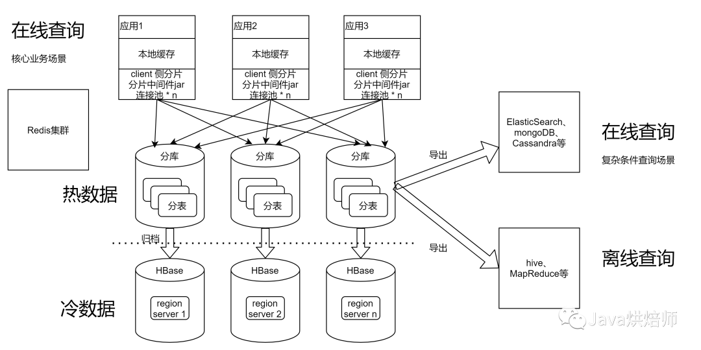

UI原型图示例：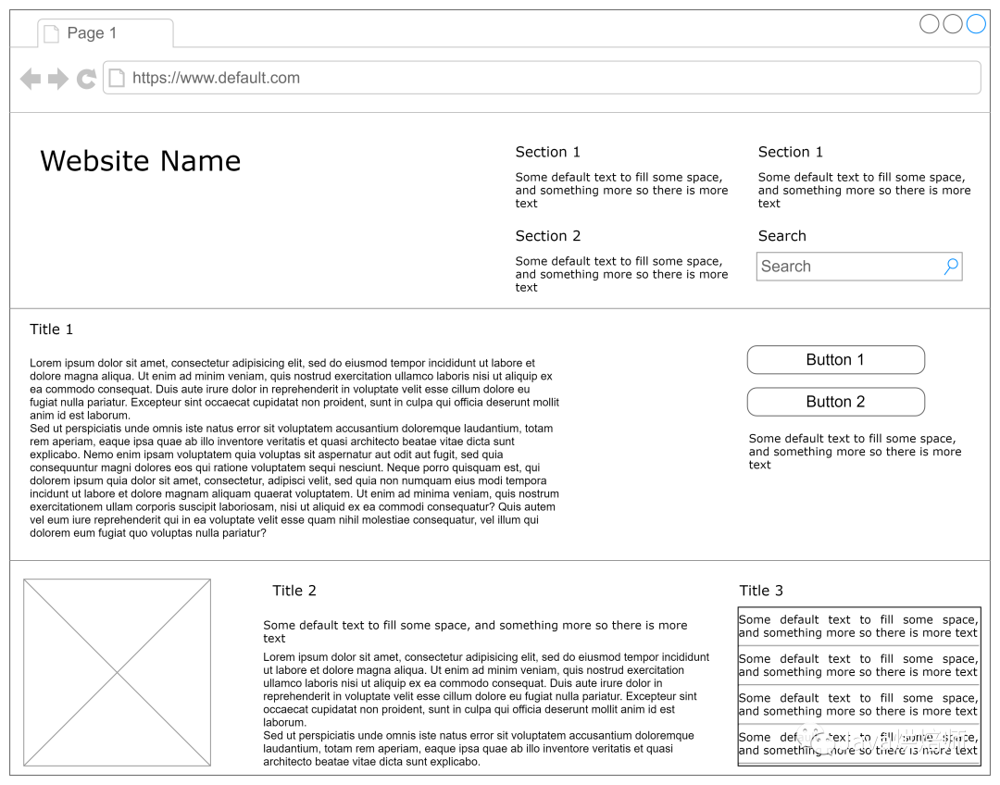

## uTools

uTools是一个工具集管理软件，可以扩展安装很多有用的小工具，对后端程序员比较有用的有：

- json格式化
- 2个文本diff比较
- 时间戳转换
- 截图识别其中的文字
- 备忘快贴，可在云端记录代码片段、备忘事项

alt+空格，快速调出utools搜索框，然后输入关键字就能快速找到相应工具。比如：对应上述的关键字，分别是json、diff、timestamp、ocr、备忘，非常便捷。

官网地址：https://www.u.tools 下面是截图示例。

json格式化：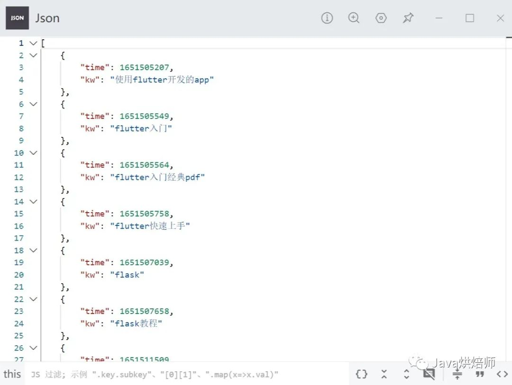

时间戳转换：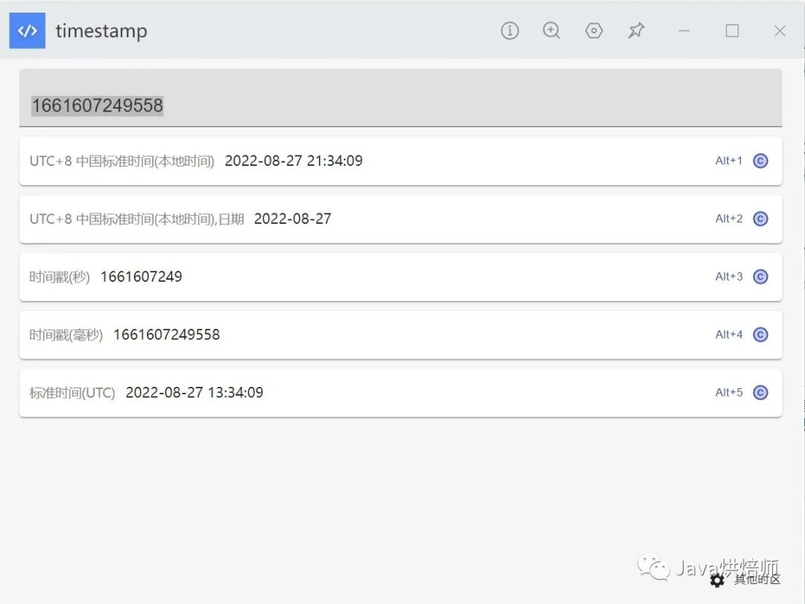

## PlantUML

手画UML时序图还是比较累的，尤其是要考虑是否对齐，直线是否水平的情况。plantUML可以把后端程序员解放出来。 只需要写一段类似代码的东西，然后就能生成规整的UML时序图。时序图语法，详见：https://plantuml.com/zh/sequence-diagram 也可以探索其他类型的UML图，但大都有更好的替代品。

示例代码：

```
@startuml
autonumber
participant Participant as Foo
actor       Actor       as Foo1
boundary    Boundary    as Foo2
control     Control     as Foo3
entity      Entity      as Foo4
database    Database    as Foo5
collections Collections as Foo6
queue       Queue       as Foo7
Foo -> Foo1 : To actor 
Foo --> Foo2 : To boundary
Foo -> Foo3 : To control
Foo -> Foo4 : To entity
Foo -> Foo5 : To database
Foo -> Foo6 : To collections
Foo -> Foo7: To queue
@enduml
```

通过命令行、或在线工具，可以生成UML时序图：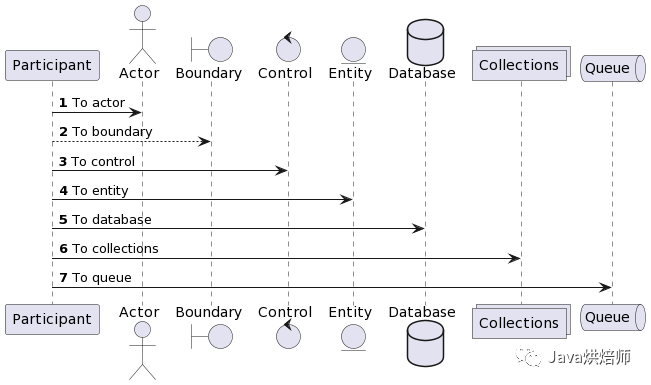

## Intellij IDEA

不必多说，Intellij IDEA是最好用的Java IDE，如果你还在用Eclipse，赶紧换了吧。 Python也有类似的Pycharm IDE，都是JetBrains公司做的，是开发Python的不错选择。 官网下载地址：https://www.jetbrains.com.cn/idea/download

最实用的功能，需要熟练掌握：

- 自动生成类图：在类文件上鼠标右键，选 Diagrams -> Show Diagram...
- 查找依赖：Find Usages
- 断点调试

类图示例：类图可参考楼主之前写的《Spring cache源码分析》

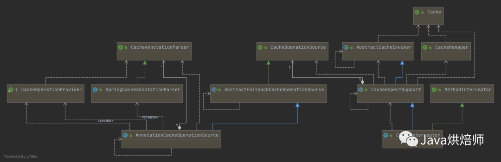

## xmind

用来画思维导图，记录灵感。 官网地址：https://www.xmind.cn

# 2、文档编辑

## mdnice

mdnice是一个微信公众号markdown排版工具，并且可以一键发布文章到多个平台，免费、省时省力。 如果你也是一个在多个平台上写技术文章的博主，mdnice就非常适用。

下载chrome插件地址：https://product.mdnice.com/membership/product

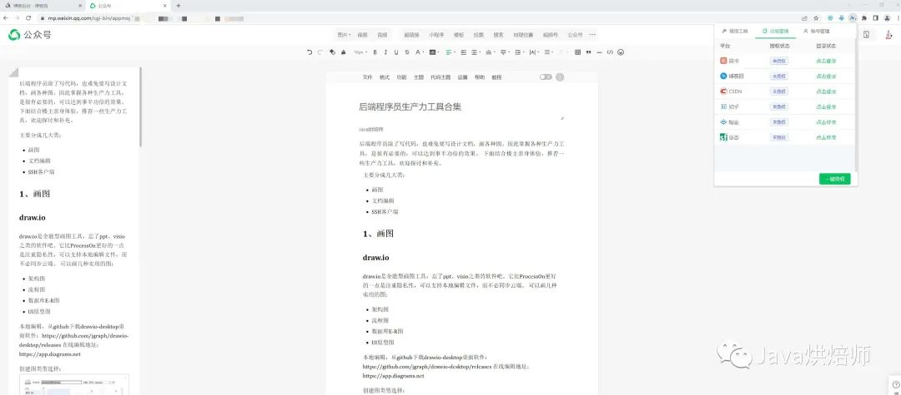

## typora

本地编辑和预览markdown文件，简洁明了。 typora中文站：https://typoraio.cn

## gitbook/mindoc

顾名思义，gitbook是通过git来实现电子书管理的工具，可以把文章组织成章节目录，就像一本电子书，使得博客/文档体系化。 当写了足够多的文章后，就可以分门别类地组织成一本电子书了。可以通过命令行工具，或在线编辑电子书。 gitbook官网地址：https://www.gitbook.com

gitbook示例：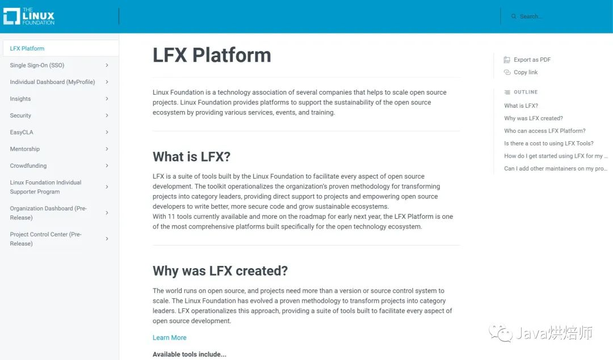

mindoc是国人实现的在线文档管理系统，效果跟gitbook类似。 mindoc github地址：https://github.com/mindoc-org/mindoc

# 3、终端客户端

## MobaXterm

MobaXterm是PC端好看、好用的终端客户端，包含SSH、VNC、SFTP等客户端。如果你还在用putty、secureCRT这种界面简陋、功能单一的客户端，不妨换这个试试。比xmanager/xshell更好的点是免费。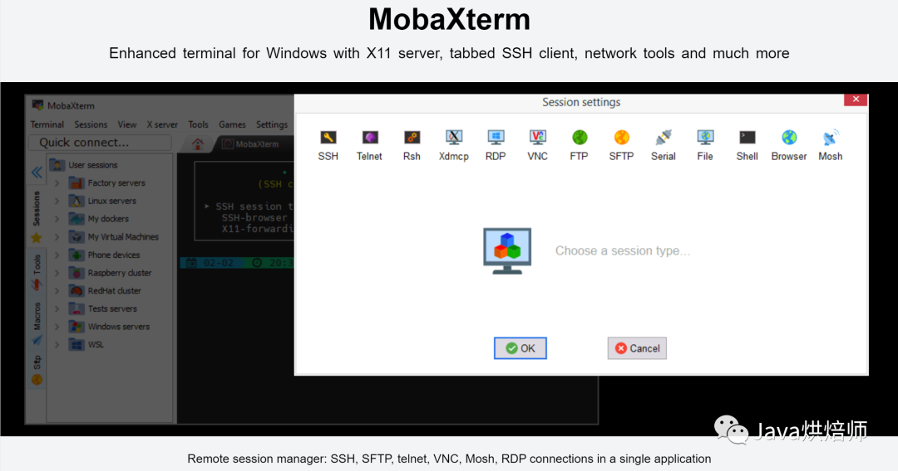

## JuiceSSH

JuiceSSH是安卓手机上好用的SSH客户端，手机上也能敲命令，连接和控制服务器了。 官网地址：https://www.juicessh.com

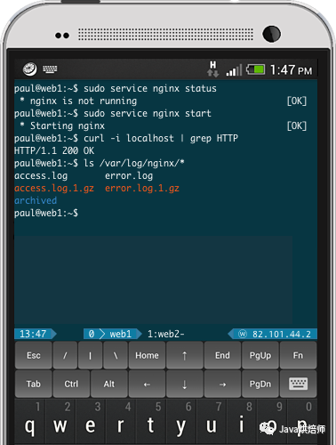

# 参考资料

- [后端程序员生产力工具合集](https://mp.weixin.qq.com/s/HGJNM6Nfzh40yoKjpsZ2PA)