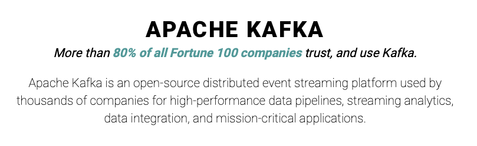

kafka声名远扬，接触或了解过微服务的，一定是绕不开这个东西的。那么开始学习kafka之前，有几个问题需要先回答好：

## 问题列表
1. 什么是kafka？
2. 为什么要学习kafka？
3. 怎么学习kafka？学习路径/参考书籍是什么？官网文档全么？
4. kafka的特点和定位是？
5. 可能的技术重点是什么？
6. 可能的重要的业务场景是什么？

## 1 什么是kafka？

参考下官网的介绍：

> 

所以我们给kafka的定义大概需要有以下几个方面：

- 归属于Apache软件基金会；
- 开源；
- 分布式事件流平台；
- 高性能；
- 典型应用场景：
  - 数据管道；
  - 流分析；
  - 数据集成（仓库？）；
  - 任务关键型应用（任务？）；

也正是如此，在官网的第一部分，就着重介绍了什么是事件流：

> #### [What is event streaming?](https://kafka.apache.org/documentation/#intro_streaming)
>
> Event streaming is the digital equivalent of the human body's central nervous system. It is the technological foundation for the 'always-on' world where businesses are increasingly software-defined and automated, and where the user of software is more software.
>
> Technically speaking, event streaming is the practice of capturing data in real-time from event sources like databases, sensors, mobile devices, cloud services, and software applications in the form of streams of events; storing these event streams durably for later retrieval; manipulating, processing, and reacting to the event streams in real-time as well as retrospectively; and routing the event streams to different destination technologies as needed. Event streaming thus ensures a continuous flow and interpretation of data so that the right information is at the right place, at the right time.

呃，就是定位很高，是软件世界的基础，但其实也就是一个自行的定义；可以理解为各种源/源头（数据库，移动设备，软件等都算）会持续不断的有事件，就形成了事件流。也可以理解为，在kafka这里，事件是最基本的单位，然后事件流是kafka处理的对象。

所以，基于事件流能干什么，就能有各种可能性。只是用不用，还得看是否真的能利用上它的高性能这个特点。

鉴于都是软件开发碰到的kafka，于是国内能看到的介绍大体是：

> Kafka 是 LinkedIn 开发并开源的一套分布式的高性能消息引擎服务，后来被越来越多的公司应用在自己的系统中，可以说，Kafka 是大数据时代数据管道技术的首选。在设计的时候，它就实现了高可靠、高吞吐、高可用和可伸缩，得益于这些特性，加上活跃的社区，Kafka 成为了一个完备的分布式消息引擎解决方案。

即高性能的消息引擎服务。

## 2 为什么要学习kafka？

- 大家都在用；
- 设计上有值得学习的地方；
- 工作中会碰到；

## 3 怎么学习kafka？学习路径/参考书籍是什么？官网文档全么？

- 参考书籍：Apache Kafka实战
- 结合官网：[Apache Kafka](https://kafka.apache.org/documentation/)

以目前的介绍来看，资料还是很全的，还需要学习中进行探索和横向比对。

## 4 kafka的特点和定位是？

定位：

- 微服务-消息代理
- 高手成长-微服务-通讯及消息

特点：

- 核心特点
  - 高吞吐量
  - 可伸缩
  - 可持久化
  - 高可用
- 生态系统
  - 嵌入式流处理
  - 连接到任意系统
  - 多语言适配
  - 开源工具多

## 5 可能的技术重点是什么？

还是从介绍和文档目录来看：

- 高性能 ---> 怎么实现的高性能？---> 官方文档关于efficiency的阐述 ---> 整体学习后的理解
- 事件流要怎么处理
- 消息引擎是个什么东西？自己怎么搭建一个消息引擎
- 怎么实现的各种核心特点

## 6 可能的重要的业务场景是什么？

从官网的介绍来看，主要有

- 消息处理
- 网站事件跟踪
- 数据监控
- 日志聚合
- 流处理
- Event Sourcing
- Commit Log

## 小结

要学要用微服务，就要学习kafka；但要知道kafka不只是消息引擎，重点关注设计思路和其带来的特性。

## 参考资料

- [Apache Kafka](https://kafka.apache.org/documentation/)

- [Kafka核心技术与实战](https://time.geekbang.org/column/intro/100029201)

- [Apache Kafka实战](https://book.douban.com/subject/30221096/)

